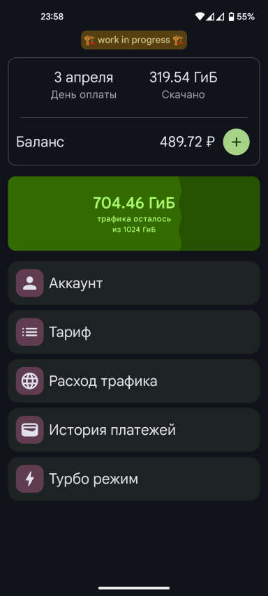
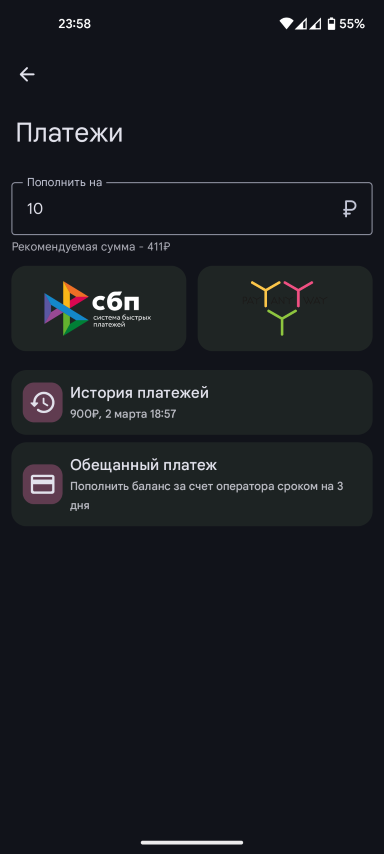
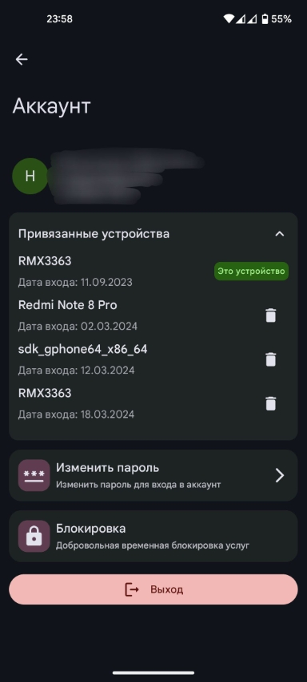

# Оргтехсервис
### NOTE: This is an alternative app for Russian internet service provider. That's why almost everything here is in Russian, sorry
### 🏗️ Work in progress. Most of the code is written to just work. We are not talking about good architecture or excellent code yet. Let's call it a prototype, I'm just testing it to see if it works 🏗️
#### 16.03.2024 - Возобновляю проект спустя 7+ месяцев простоя
**НЕОФИЦИАЛЬНОЕ** мобильное приложение для интернет-провайдера оргтехсервис. Официальное приложение можно найти в [Google Play](https://play.google.com/store/apps/details?id=com.orgtechservice.cabinet)

  
  
  

### Отличия от официального приложения (на данный момент)
- Открытый исходный код
- ~~Material3 дизайн~~ (официальное приложение было переделано на Material3 в январе)
- Быстрее, по крайней мере пока что
- Отсутствие различных ограничений:
  - История расхода трафика по месяцам, показывает всю историю, а не только последние 6 месяцев.
  - И прочие списки показываются в полном их объеме, а не ограничены первой страницей из API или как-то еще, как в официальном приложении.
 

####
~~P.S есть фичи, которые скорее всего не будут реализованны. Например, смена тарифа или добровольная блокировка. Причина проста, чтобы перехватить API запрос, мне нужно будет воспользоваться этими фичами, чего мне делать очень не хочется или не получится.~~
**Обновление от 12.03.2024 - Слава декомпиляции. Новая версия официального приложения свободно декомпилировалась и теперь у меня есть файлик со всеми API, параметрами и ответами. Опять же, вышеперечисленные фичи тестировать я не буду, а просто помолимся, что они работают**
###### (по голове не дадут за такое? да не должны)
## Стек
- [Material3](https://m3.material.io/) - дизайн и гайдлайны по интерфейсу
- [Hilt](https://developer.android.com/training/dependency-injection/hilt-android) - DI фреймворк
- [Compose Destinations](https://github.com/raamcosta/compose-destinations) - Навигация между экранами
- [Retrofit2](https://github.com/square/retrofit) и [OkHttp3](https://github.com/square/okhttp) - Запросы к API
- [DataStore](https://developer.android.com/topic/libraries/architecture/datastore) - Постоянное хранилище данных
- [Paging 3](https://developer.android.com/topic/libraries/architecture/paging/v3-overview) - Пагинация данных
- [Flow](https://kotlinlang.org/docs/flow.html) - Асинхронные потоки данных и реактив
- [Coroutines](https://kotlinlang.org/docs/coroutines-overview.html) - Асинхронность
- Прочите штуки, типа ViewModel и тому подобное, дефолт
